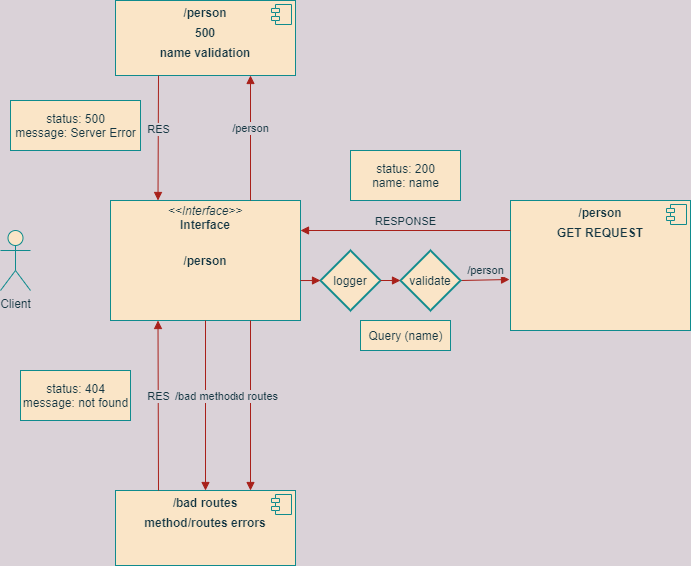

# basic-express-server

## URL links for Heroku

- main branch
  [omar-server-deploy-prod](https://oht-express-server.herokuapp.com/)

- Github Pull Request
  [Pull-Request](https://github.com/Omar-Tarawneh/basic-express-server/pull/1)

- Action
  [Action](https://github.com/Omar-Tarawneh/basic-express-server/actions)

## Data Flow Diagram

## Download And Start

- Clone the Repository into your local machine
  `git clone httpLink/sshlink`

- Get into the repo directory
  `cd basic-express-server`

- Install the dependences for tha app
  `npm install`

- Add your dotenv File and add your PORT
  `touch .env`
  `PORT=3000`

- Test the functionality of the app by typing:
  `npm test`
